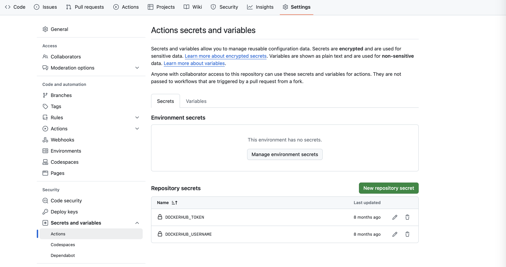

# a-github-action-for-quarkus
A GitHub Action file that checks out, packages, builds and pushes a Docker container

I originally gave this repo the name, quarkus-github-action, which is the name of a [Quarkiverse plugin](https://github.com/quarkiverse/quarkus-github-action) for creating GitHub Actions with Quarkus. The old repo is still live with a link to this one.

## Description
The build uses Temeurin Java 21.  Check with actions/setup-java@v4 to change the version.

The Docker container uses the POM's artifactId for the name of the container and the POM's version for version.  The container is also tagged, "latest."

## To Use
Drop the .github directory into your Quarkus project.  Add your Docker hub username and an access token as secrets to your repository's actions.  Directions for creating tokens can be found here: http[...]

